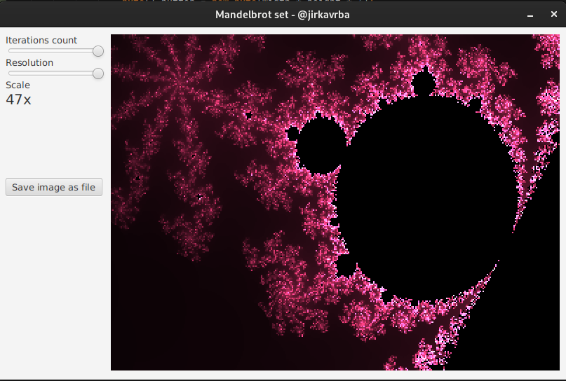

# Simple mandelbrot viewer written in JavaFX

NOTE: This was coded in about an hour, contains many bugs, has limited iterations,
resolution, is not optimized in any way.

Zooming is somehow broken when zooming out?

